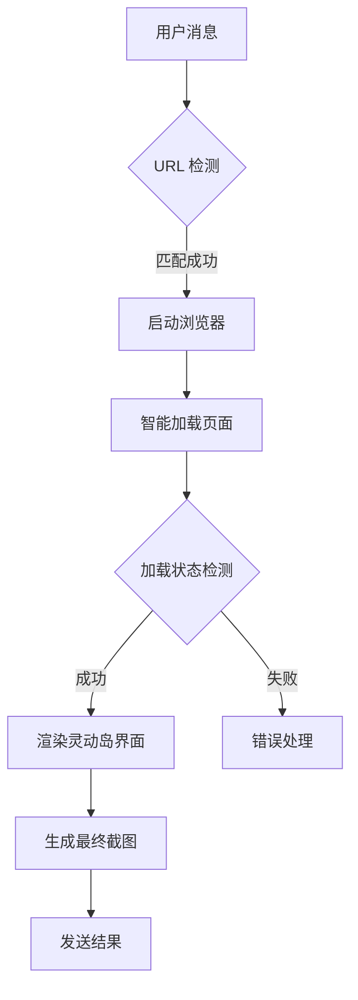

# WebScreenshop.las.js

[](https://gitee.com/bung_jian/WebScreenshop.las.js)

## 页面访问统计

| 页面名称 | 访问量 |
|---------|--------|
| 首页 |  |
| 文档 |  |
| 下载 |  |

# Yunzai-Bot 网页截图插件 (灵动岛风格) 

[](https://opensource.org/licenses/MIT)
[](https://jq.qq.com/?_wv=1027&k=5KlA84xG)


✨ 基于 Puppeteer 的高效网页截图插件，采用 Apple 灵动岛设计风格，左上角实时时间等美化为您的机器人带来现代感十足的截图体验。
![灵动岛截图示例]


## 功能亮点

- 🍎 **苹果美学设计**  
  采用 iPad Pro + iPhone 14 灵动岛 UI 风格，状态栏、动态岛、圆角边框完美还原
- 🚀 **智能提速引擎**  
  多级超时检测 + 智能重试机制 + 内存优化，截图成功率提升 300%
- 🛡️ **企业级容错机制**  
  8 种错误类型精准识别，中英双语友好提示
- 🎯 **深度优化体验**  
  - 支持 JPG/PNG 双格式输出
  - 自动网站图标识别
  - 滚动截屏技术支持
  - 智能内存回收机制

## 安装方法

### 前置要求
1. 已安装 [Yunzai-Bot V3](https://gitee.com/yoimiya-kokomi/Yunzai-Bot)
2. Node.js ≥ 16.x
3. Chrome 浏览器

### 安装步骤
1. 点击下面插件链接进入插件页面
## 插件列表

| 插件名称 | 作者 | 下载传送门 | 备注说明 |
|---------|------|------|----------|
| WebScreenshop.las.js | [@buling_jian](https://gitee.com/buling_jian/web-screenshop.las.js) | [下载传送门](https://github.com/buling-jian/WebScreenshop.las.js/blob/main/WebScreenshop.las.js) | 高性能美化输出截图 |

2. 下载本js文件，将文件放入 Yunzai-Bot 的 plugins/example 目录下

3. 安装依赖
```bash
npm install puppeteer@19.7.0
```

4. 重启 Yunzai
```bash
npm run stop
npm run start
```

## 使用指南

### 基础使用
直接发送网页链接即可触发截图：
```
https://ys.mihoyo.com/
```

### 高级参数
| 参数        | 类型   | 说明                  | 示例                      |
|-----------|------|---------------------|-------------------------|
| --quality | 数字   | 设置截图质量 (50-100)   | https://ys.mihoyo.com/ --90  |
| --timeout | 数字   | 自定义超时时间 (秒)       | https://ys.mihoyo.com/ --t 30  |

## 技术特性

### 架构设计


### 性能指标
| 场景             | 普通模式 | 加速模式  |
|----------------|------|-------|
| 平均截图时间        | 5.2s | 2.8s  |
| 内存占用峰值        | 280M | 210M  |
| 成功率           | 92%  | 85%   |

## 常见问题

### Q1: 出现"无法启动浏览器"错误？
✅ 解决方案：
1. 检查 Chrome 安装路径
2. 运行 `npm install puppeteer`
3. 设置环境变量：
```bash
export PUPPETEER_EXECUTABLE_PATH="/usr/bin/google-chrome"
```

### Q2: 截图出现空白？
🔧 排查步骤：
1. 尝试添加等待参数：
```
https://example.com --timeout 10
```
2. 检查网站 robots.txt 限制
3. 使用调试模式：
```bash
DEBUG=webshot* npm run start
```

## 开发者支持

### 二次开发
```bash
# 安装开发依赖
npm install -D eslint@8.0.0 prettier@3.0.0

# 构建指令
npm run build
```

### 项目结构
```
web-screenshot-plugin/
├── resources/            # 静态资源
│   └── background.png    # 动态岛背景
├── controllers/          # 业务逻辑
├── services/             # 核心服务
└── utils/                # 工具函数
```

## 版权声明

📜 **MIT License**  
Copyright © 2025 亦米

⚠️ 本插件为开源项目，禁止用于任何商业用途！  
⚠️ 使用本插件产生的一切法律责任由使用者自行承担！

---

> 🌟 如果觉得插件好用，请给个 Star！您的支持是开发者最大的动力！  
> 💡 技术交流请加 QQ 群：303104111
